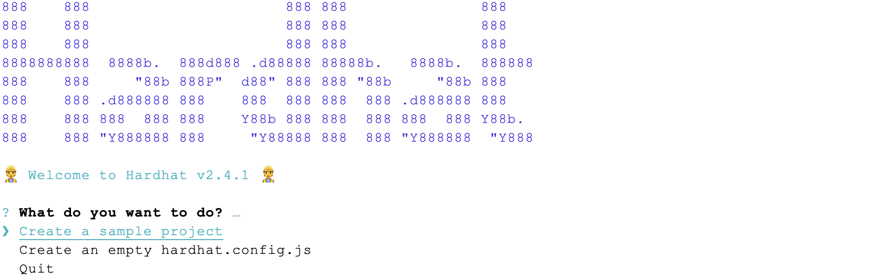

# eth_series #show 1.
###### Folks! wear Hardhat don't get wet.


###### image Copyright (c) 2019 ethereum.org contributors

#### [eth_series #show1 source code](https://github.com/xioxium/eth_series/blob/main/doc/show1.md)
#### [jump back to the #index!](https://github.com/xioxium/eth_series/blob/main/README.md)

Hello,  
I want to start our journey in this colorful world of ethereum, introducing the Ethereum IDE Hardhat.  
If we surf to the [homepage](https://hardhat.org/) of the project we will se a lot of happy nuggets working, jumping and doing funky things wearing a nice yellow working hardhat, but once we jump into the [documentation](https://hardhat.org/getting-started/) we see that is serious stuff.  
What is the first action I do once discovered a new development tool? I jump straight to the docs and check them out then I assure my self that is an open source project, and I run like crazy on GitHub, that in the case of Hardhat it's [here](https://github.com/nomiclabs/hardhat), and I have a look at the source code.  
Hardhat is cool because its run depends on nodejs, I mean, it is not a standalone executable that it's accessible from the bash, but it runs on the server side with our beloved nodejs in fact to use it we need to create a nodejs project and install it as a dependency of our project:

```bash
xioxium@ethereum:~$ mkdir "SmartContract"
xioxium@ethereum:~$ cd "SmartContract"
xioxium@ethereum:~$ npm init
xioxium@ethereum:~$ npm install --save-dev hardhat
xioxium@ethereum:~$ npx hardhat
```

the last command will show us another nice graphic:


here we can choose, by using the arrow keys of our keyboard, between a sample configuration project, or an empty configuration file, in most of the posts I'll write you'll see me opting in for the second one. Fun fact I never chose to ´Quit´!´ 😃

the configuration file I'll use to deploy "the very basic smart contract" on the rinkeby test network, through the help of my favourite ethereum node API [Alchemy Supernode](https://www.alchemy.com/supernode), it looks like this:
```js
/**
 * @type import('hardhat/config').HardhatUserConfig
 */
require('dotenv').config();
require("@nomiclabs/hardhat-ethers");
const { API_URL, PRIVATE_KEY } = process.env;
module.exports = {
    solidity: "0.8.0",
    defaultNetwork: "rinkeby",
    networks: {
        hardhat: {},
        rinkeby: {
            url: API_URL,
            accounts: [`0x${PRIVATE_KEY}`]
        }
    },
}
```

You may wonder

> oh but this is going to be so difficult, and there is a lot of things to read! show me the code!!!

well, I haven't said

> I'll TEACH you the fantastic shortcut for success and start earning billions of dollar with few lines of code

clarified this point, continue;

###### the hardhat task creation.
during the deploy of the smart contract we will need:
* to create a new wallet with [Metamask](https://metamask.io/)
* to fill up with some ETH our brand-new wallet using the [Rinkeby Faucet](https://faucet.rinkeby.io/) 
* we will create a Hardhat task, for demonstration purpose, to check the balance of our wallet after any changes occurred to the smart contract, without using the Metamask App.

It's important to get used to the command line point of view and not just rely on the graphical interfaces. Graphical interfaces are good, and we will design some to see how to interact with the blockchain from the front-end, but the _**CLI make it swift**_ 😎

###### the hardhat shorthand & hardhat-completion

These are two nice utility that give us the opportunity to run hardhat straight from the bash

```bash
xioxium@ethereum:~$ npm install -g hardhat-shorthand
xioxium@ethereum:~$ hh console
xioxium@ethereum:~$ hardhat-completion install
```

the second command it is a wrapper for `npx hardhat console`, short story it just executes nodejs to run hardhat, but still it's cool, I personally not use it, and the hardhat-completion work good with the bash.  
just check it on the Hardhat website how to use it [hardhat-completion](https://hardhat.org/guides/shorthand.html)

###### hardhat plugins

The plugins you can use with hardhat are a lot but one popped up from the crowd and let me see the future
[@eth-optimism/plugins/hardhat/compiler](https://hardhat.org/plugins/eth-optimism-plugins-hardhat-compiler.html) I didn't try it because I'm still focusing on the current stage of ethereum, but keep an eye on it doesn't seem a bad idea.

###### good night and I'm going to cook carbonara 🍝
The #show 1 is over but still we will see together what we can do with hardhat in the next shows enjoy your day and wear a **HAT**

see you.
