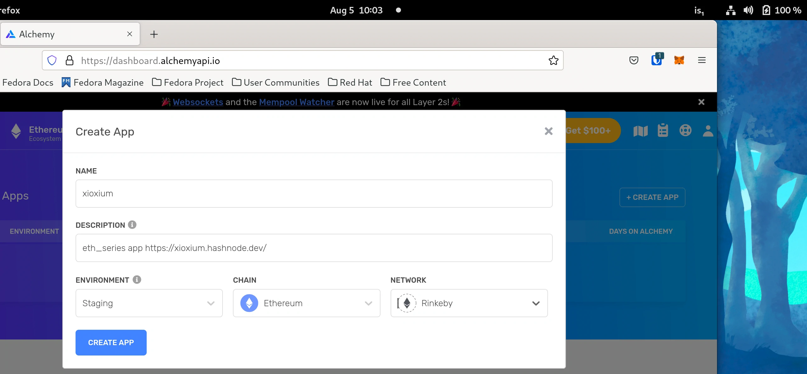

# eth_series #show 3.
###### tools for dev ethereum smart contracts. VSCode, NodeJS and Hardhat.


###### image Copyright (c) 2019 ethereum.org contributors

#### [eth_series #show3 source code](https://github.com/xioxium/eth_series/blob/main/doc/show3.md)
#### [eth_series #show3/3b source code for the application](https://github.com/xioxium/eth_series/tree/main/src/show3)
#### [jump back to the #index!](https://github.com/xioxium/eth_series/blob/main/doc/index.md)

⚠️ `links don't open in a new browser tab, just saying`

## - intro greetings
hello everybody, long time since the last carbonara 🍝  
I have been busy very much, how about you then? Any good any bad? learned something new? Want to share? 😊

## - summer is gone
I deployed a private blockchain on my home network using [Hyperledger Burrow](https://github.com/hyperledger/burrow), I tested a bit all the beautiful things that can be done with it. During an online workshop, with the Hyperledger Foundation, just FYI, I found out that the Burrow Project went from incubation to a non-Active status cause the developer in charge just left. Or,  I mean the project has no chief at the moment. You may probably want to take over? Hyperledger's people look very welcoming, and Burrow it's completely written in GoLang, I have no clue with this programming language maybe you do? I mean, just saying folks, just saying...

I have been dealing with containers, [Fedora CoreOS](https://getfedora.org/en/coreos?stream=stable), reading manuals of any kind, practicing on [Buildah](https://github.com/containers/buildah) and [Podman](https://github.com/containers/podman) , going deep into the understanding of [Nginx](https://www.nginx.com/) and [NodeJS](https://nodejs.org/en/).  
These kool things all together, are solid basement for the traditional web, web3 and blockchain technologies, if I'm saying this it's because I mean it.

## - the real post
Let's go back where I was and today I’ll talk about the IDE I’ll use to show you my progress and to deal with the project summarised during [#show1](https://github.com/xioxium/eth_series/blob/main/doc/show1.md).

>I truly believe that a master developer must use plain text editors with no syntax highlighting, plugins or icons theme to make the things nicer and must only read the technical manuals of the programming language. Turned off the internet connection, the master developer must find out the solution by sweating blood and… just kidding!

### - same sad story

I have been a photographer for the greater part of my life. At school, I have been studying the Ansel Adams "Zone System", divided on three books, full of practical examples, and a lot of theoretical stuff. At that time I owned already a digital camera, and the Adams's system is about analogue cameras, film developing and printing in the camera obscura.  
I liked it so much that I became a bit cocky against digital photography, affirming that it is the laziest tools ever invented. Then, I accidentally "grew up", and I accepted the hardest reality... What the hell, It’s the 21st century! Obviously we got to use all these beautiful advanced devices to make our work flow more comfortable. Comfortable yes, but conscious that will not be that smooth because there are many challenges to be solved, doesn't matter how advanced the tools in use are.

###### Check Ansel Adams Photography. It's great 👉 [Ansel Adams Twitter](https://twitter.com/TheAnselAdams/media?ref_src=twsrc%5Egoogle%7Ctwcamp%5Eserp%7Ctwgr%5Eauthor)

### - Said so 🥁🥁🥁

> **Proudly and boldly I’ll introduce you VS Code! do you know it? Nobody? Everybody? Both cases we’ll see how to set it up, we’ll choose useful extensions for the purpose of this eth_series and so on.**

###### 🧐 wondering if VS Code is open source? Of course, and it is distributed under the MIT License 👉 [github](https://github.com/microsoft/vscode)

## - Visual Studio Code, [let's start by grabbing it!](https://code.visualstudio.com/Download)

> Always keep in mind that this is my own point of view, and you can use the whatever you want because... [#read first what IS and what IS NOT](https://github.com/xioxium/eth_series/blob/main/doc/is_isnot.md)

I'm going to install two extensions, search for it into the extensions panel:
- solidity
- STFP


so, so what?!?

open the console of your Operating System and make a new directory
> ⚠️ I use Linux Fedora 34 it may differ from your operating system

skip the comments [#] in case you love `copy & paste` learning style  
```bash
[xioxium@ethereum ~]$ mkdir -p eth_series/contract 
# the -p option create the directory structure also if a sub-directory does NOT exist 
[xioxium@ethereum ~]$ touch eth_series/contract/xioxium.sol
[xioxium@ethereum ~]$ code eth_series/contract/xioxium.sol 
# maybe your OS has a different way to call VSCode from the shell
```

and KABOOOM you are in


## - NodeJS 16 Installation and initialization of the project.

> if you would like to know how to grant, your Fedora 34 user, NO PASSWORD anytime invoking `sudo` command, just text me a line to xioxium@protonmail.com and I'll be glad to write a blog post.

remember to skip the comments [#] `copy & paste`ing folks 
```bash
[xioxium@ethereum ~]$ sudo dnf module enable nodejs:16 -y 
# first I let dnf to know that I want nodejs:16 module to be enabled
[xioxium@ethereum ~]$ sudo dnf module install nodejs:16/default --setopt=install_weak_deps=false -y 
# there are three ways to install nodejs - default/minimal/development 
# basically minimal comes without npm, and sure I do need it.
# I'm not going to develop for nodejs so I don't need the development packages
```


> ℹ️ sheet ;) `dnf --setopt=install_weak_deps=false`  
> I always skip to install not required dependencies because of a very simple reason:
> + deps take space on the hard-drives and in the case you, as me, will start using one of the cloud provider out there, keep in mind that storage is expensive.

```bash
[xioxium@ethereum ~]$ cd eth_series/
[xioxium@ethereum eth_series]$ code ./ 
# in this way we open the folder of our project, I can save it as a workspace, generally I don't.
# why? I'm reckless 🐇
[xioxium@ethereum eth_series]$ npm init 
# it will ask for some infos, I fill it up as I like it
```


our VSCode friendly IDE has got the package.json, at this time I don't need to set any entrypoint or git or any test. I'll do it later, maybe, just if I really need it, you know.

> ℹ️ sheet ;) from the screenshot npm is suggesting to update to the minor version. Would you dare do it?

## - Hardhat and Alchemy account

### - Alchemy [sign up here](https://alchemy.com/?r=63bf4f0cd14acca3)
>###### [more about referral program can be found here, if you sign up with my referral I'll thank you very much](https://docs.alchemy.com/alchemy/introduction/referral-program#referral-link)
### -What is Alchemy?
>Alchemy is an ancient philosophic point of view which the alchemists practicing a sort of magic are able to transform the surrounding world as they like it. During Medieval Times in Europe heresy was going to be punished with **death sentence**. Two alchemists caught my attention, Tommaso Campanella and Giordano Bruno. The first one wrote a book, during 27 years of imprisonment and tortures, which tells us a way how to create a Utopian society. The second burnt alive as a heretic in a public square in the city of Rome on this day -> 17 February 1600. 

have you finished signing up for a free account on Alchemy? Yes sure. I know you have done it.

From you Alchemy Dashbord create an app is very simple:
- give it a name
- a nice description
- in this case we use the Staging environment
- Ethereum as the chain
- Rinkeby as network.

> ⚠️ if you chose a different network than Rinkeby you need to update the [hardhat.config.js](https://github.com/xioxium/eth_series/blob/main/doc/show3.md#--hardhat-config-file)



### - Hardhat
Four main functions we will use:
- initiate a project 
- compile
- deploy
- run

```bash
[xioxium@ethereum eth_series]$ pwd 
# always check your current directory if you are out of eth_series, cd in there
[xioxium@ethereum eth_series]$ npm install --save-dev hardhat
[xioxium@ethereum eth_series]$ npx hardhat 
# to initiate a new project in the eth_series folder
888    888                      888 888               888
888    888                      888 888               888
888    888                      888 888               888
8888888888  8888b.  888d888 .d88888 88888b.   8888b.  888888
888    888     "88b 888P"  d88" 888 888 "88b     "88b 888
888    888 .d888888 888    888  888 888  888 .d888888 888
888    888 888  888 888    Y88b 888 888  888 888  888 Y88b.
888    888 "Y888888 888     "Y88888 888  888 "Y888888  "Y888

Welcome to Hardhat v2.5.0

? What do you want to do? … 
  Create a sample project
▸ Create an empty hardhat.config.js
  Quit

```

👉 **Create an empty project**  
I'm going to modify the file hardhat.config.js later because first I want to generate an Ethereum address to use for the project. To do so, I'm going to use [ethereumjs-wallet](https://github.com/ethereumjs/ethereumjs-wallet)

```bash
[xioxium@ethereum eth_series]$ npm install ethereumjs-wallet
[xioxium@ethereum eth_series]$ mkdir scripts
[xioxium@ethereum eth_series]$ touch scripts/wallet.generator.js
```

**get your Alchemy App Key first. Be sure to copy the HTTP, just for now.**


using VSCode write this on the new touched file wallet.generator.js
```javascript
// requires
const fs = require('fs')

/**
 * creation of the .gitignore file to exclude:
 * - node_modules
 * - .env
 * to be excluded from git repository when pushing the changes online
 */
function gitignoreGeneration(){

    // array of the files intended to be gitignore joined by a new line character to return a nice string
    const gitignore = [
        'node_modules',
        '.env'
    ].join('\n')

    fs.writeFile('./.gitignore', gitignore, (error)=>{
        if (error) throw error
        console.log('.gitignore written on disk')

        // check if the data into the file is correct
        fs.readFile('./.gitignore',(error, data) => {
            if (error) throw err
            console.log(data.toString())
        })
    })
}


/**
 * creation of the .env file
 * log into Alchemy and use your private key as parameter
 * be sure that includes the full https link to your key
 * @param {string} AlchemyProjectKey
 */
function envGeneration(AlchemyProjectKey){

    // inclusion of the ethereumjs-wallet
    const Wallet = require('ethereumjs-wallet')

    // generation of address and private-key
    const xioxium = Wallet.default.generate()

    let env = `ALCHEMY_KEY = "${AlchemyProjectKey}"\n`
    env += `WALLET_ADDRESS = "${xioxium.getAddressString()}"\n`
    env += `WALLET_PRIVATE_KEY = "${xioxium.getPrivateKeyString()}"\n`

    fs.writeFile('./.env', env, (error)=>{
        if (error) throw error
        console.log('.env written on disk')

        // check if the data into the file is correct
        fs.readFile('./.env',(error, data) => {
            if (error) throw err
            console.log(data.toString())
        })
    })
}

/**
 * this is a simple function that checks if the files .env and .gitignore have been created
 * if files exist both it prevents to overwrite the files.
 * in the case just one of the file is missing it creates the file
 *  * log into Alchemy and use your private key as parameter
 * be sure that includes the full https link to your key
 * @param {string} AlchemyProjectKey
 */
function initialization(AlchemyProjectKey){
    const files = [
        './.gitignore',
        './.env'
    ]

    files.forEach(( file )=>{
        if (!fs.existsSync( file ))
            if(file ==='./.gitignore'){
                gitignoreGeneration()
            }else if(file === './.env'){

                envGeneration(AlchemyProjectKey)
            }
    })
}

initialization(YOUR_ALCHEMY_API_KEY)
```
go back to shell and run the script.

```bash
[xioxium@ethereum eth_series]$ node script/wallet.generator.js
```

😎 Such a kool thing right?  
copy the just created WALLET_ADDRESS value from the .env file. **DO NOT** use the WALLET_PRIVATE_KEY value.

> ⚠️ **Regarding WALLET_PRIVATE_KEY thingy...  
> I don't have to tell you to use this wallet just for development purpose right? Anyway, do not share it never, mama said.**

create a post on Twitter with just the WALLET_ADDRESS in it. Follow this [link](https://faucet.rinkeby.io/) and paste the link to the tweet, wait few seconds, _now you can delete the tweet_.

#### how to check the wallet balance?
###### three ways:
- Rinkeby explorer: [this my rinkeby only dev address](https://rinkeby.etherscan.io/address/0xedfec05ee692f4b35cdcbd7c355d55bd67f8d755) replace my wallet address with yours WALLET_ADDRESS, and you'll see that the faucet worked amazing.
- [Metamask](https://metamask.io/) install the extension for the browser and import the WALLET_PRIVATE_KEY and change from "Ethereum Main Network" to "Rinkeby Test Network".
- Using the web3.js through the shell, I 💘 shells.

I will use my last generated wallet address, my alchemy api key to set up web3.js to check the balance.  
jump to the shell finishing the initial setup for the application, wow hard-work uh?!?
```bash
[xioxium@ethereum eth_series]$ node script/wallet.generator.js 
# THIS WAS THE LAST COMMAND WE RAN

[xioxium@ethereum eth_series]$ npm install dotenv 
# I will also need this package to edit the hardhat.config.js
[xioxium@ethereum eth_series]$ npm install web3 
# yeahhhhh here I go to connect my tiny app to the big Ethereum!
[xioxium@ethereum eth_series]$ touch script/wallet.balance.js
```

Edit the file wallet.balance.js in VSCode

```javascript
// requires
const web3 = require('web3')
require('dotenv').config()

// import the env keys 
const {ALCHEMY_KEY, WALLET_ADDRESS} = process.env;

let xioxiumBalance = new web3(ALCHEMY_KEY);

// let get the Promise into the variable "balance"
let balance = xioxiumBalance.eth.getBalance(WALLET_ADDRESS);

// wait a second and kaboom!
balance.then((balanceWei)=>{
    // the default response comes in Wei, we convert it to ETH
    let balanceETH = web3.utils.fromWei(balanceWei) + ' ETH'
    console.log(balanceETH)
}).catch((error)=>{ // maybe occur an error
    console.log(error)
})
```
execute the script and check that your Rinkeby ETH are in there
```bash
[xioxium@ethereum eth_series]$ node script/wallet.balance.js
```
 you can go into your Alchemy dashboard and see this API call, if you wish ;)

### - Hardhat config file

```bash
[xioxium@ethereum eth_series]$ npm install -D @nomiclabs/hardhat-ethers
```

in VSCode open the file hardhat.config.js and replace the existing code with the below given

```javascript
/**
 * @type import('hardhat/config').HardhatUserConfig
 */
require('dotenv').config();
require("@nomiclabs/hardhat-ethers");
const {ALCHEMY_KEY, WALLET_PRIVATE_KEY} = process.env;

module.exports = {
    // I'm going to use the last version of solidity compiler
    solidity: "0.8.6",
    defaultNetwork: "rinkeby",
    networks: {
        hardhat: {},
        rinkeby: {
            url: ALCHEMY_KEY,
            accounts: [`${WALLET_PRIVATE_KEY}`]
        }
    },
}
```

now let's check if the configuration file is good, if everything is alright it will print the hardhat help.
```bash
[xioxium@ethereum eth_series]$ npx hardhat
```

Ok folks, the today show is over. Kind of glad, if I got to speak the truth ;) 
#### - I have left the best part for the next show 
I will write a smart contract with some funky methods to play with and waste a bit of rinkeby ETH, just like some human beings do with real money money jump here crash there, I 'll do the same to have fun. Hopefully some of you will come to play with :( testing the stupid contract :)

have a good alchemist day. _**chose wisely if you want to be the 27 years tortured Campanella or to be burnt in a public square like our beloved Giordano Bruno.**_  
Hugs y'all!

